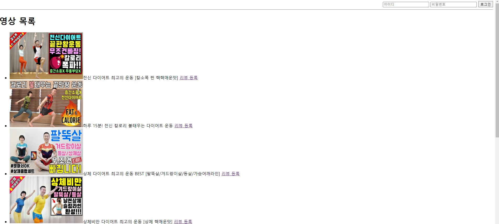
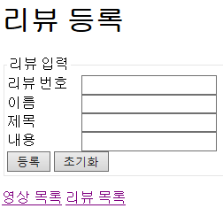
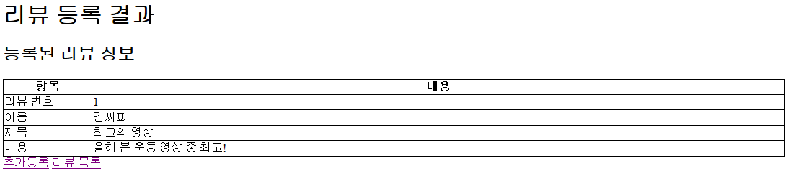
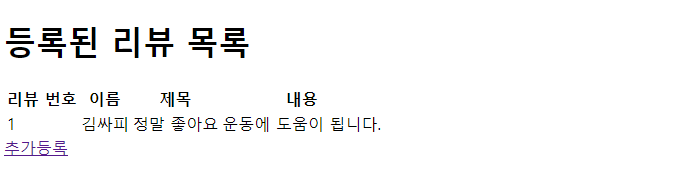

# SSAFY_BACK 관통 프로젝트

## 프로젝트 소개
SSAFY 9기 BACK 관통 프로젝트입니다.

### 역할
- 정의석 : 
인터페이스 설계
로직 구현

- 김민우 : 
클래스
로직 구현

### 프로젝트 상세
- 메인 화면

이 페이지는 메인 페이지 화면입니다.
메인 페이지에서는 그림과 같이 영상을 선택하여 해당 영상을 시청하거나, 영상에 리뷰를 등록할 수 있습니다.

- 리뷰 등록 화면

이 페이지는 리뷰 등록 화면입니다.
사용자로부터 영상에 대한 리뷰를 입력 받습니다.

- 리뷰 등록 결과 화면

이 페이지는 리뷰 등록 결과 화면입니다.
사용자가 입력한 영상 리뷰 내용을 확인합니다.

- 목록 화면

이 페이지는 목록 화면입니다.
사용자가 작성한 리뷰의 목록을 가져옵니다.

### README 작성 참고 사이트
- https://github.com/nlohmann/json/blob/develop/README.md
- https://gist.github.com/PurpleBooth/109311bb0361f32d87a2
