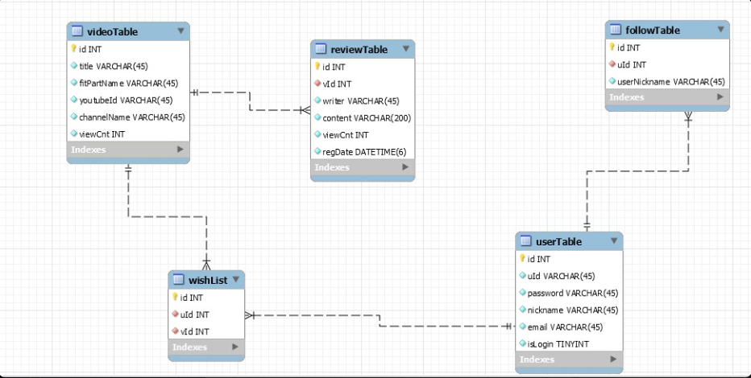

# DB 관통프로젝트

### 운동 영상 게시판 데이터베이스 설계

운동 영상에 대한 정보와 리뷰, 유저 정보, 유저의 팔로우 리스트와 유저의 찜 리스트들을 데이터베이스에 저장하고 관리할 수 있습니다.

## 팀원

* 신택수 정의석
    - ER Diagram 작성 및 데이터베이스 설계, DDL, DML 작성

## 테이블 기능

1. 비디오 테이블은 영상의 제목, 운동부위, 유튜브 아이디, 채널명, 조회수를 조회하거나 저장 및 수정할 수 있습니다.

2. 리뷰 테이블은 비디오의 ID를 가져와서 해당 영상의 리뷰를 작성하고, 리뷰 작성자, 리뷰 내용, 조회수, 등록일을 조회 및 수정할 수 있습니다.

3. 유저 테이블은 사용자의 id와 pw, 닉네임, 이메일, 로그인 여부를 조회할 수 있습니다.

4. 위시 리스트에는 유저의 아이디와 비디오의 아이디를 참조해 해당 유저가 찜한 영상을 확인할 수 있습니다.

5. 팔로우 테이블에는 유저의 아이디와 유저 닉네임을 참조해 각 유저별 팔로우한 유저를 확인할 수 있습니다.

## ER Diagram

