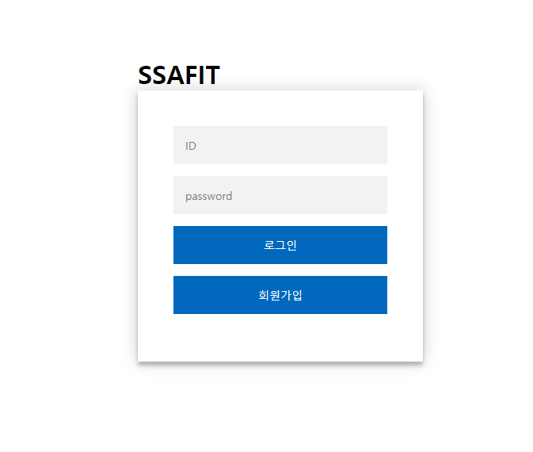
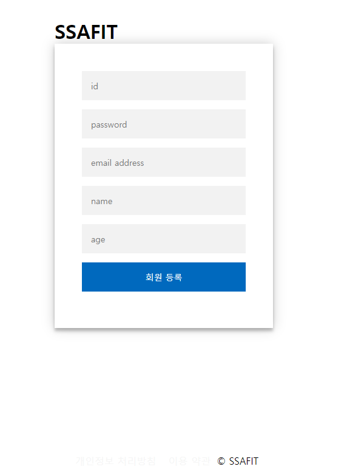
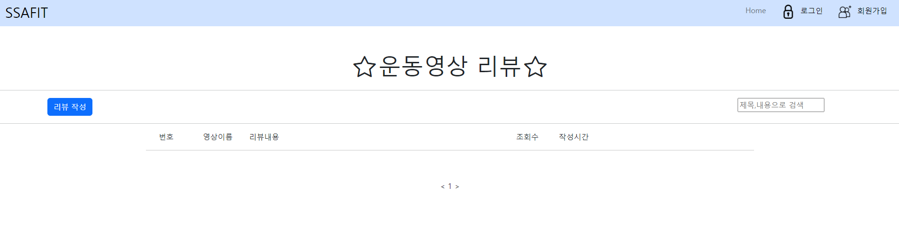
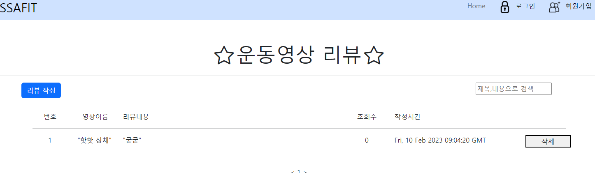
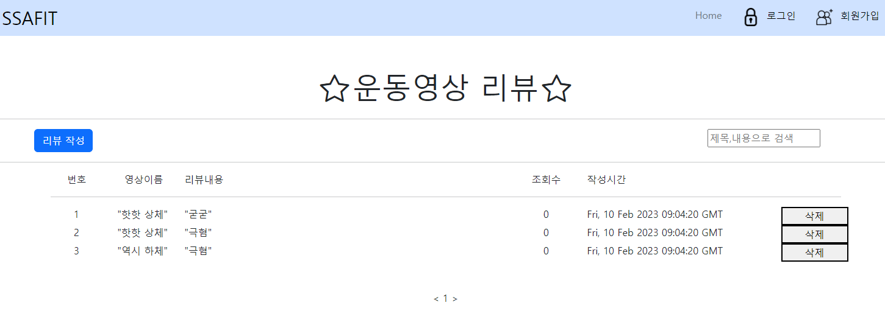

# SSAFY_FRONT 관통 프로젝트

## 프로젝트 소개
SSAFY 9기 FRONT 관통 프로젝트입니다.

### 역할
- 정의석 : 
메인 페이지 구현
로그인 페이지 구현
회원가입 페이지 구현

- 박대균 : 
리뷰 페이지 구현
리뷰 등록 상세 페이지 구현
리뷰 삭제 기능 구현

### 프로젝트 상세
- 메인 화면
메인 화면입니다. home버튼을 누르면 새로고침 되고, 로그인을 누르면 로그인 페이지로, 회원가입을 누르면 회원가입 페이지로 이동할 수 있습니다.
운동 영상에 있는 리뷰 등록 버튼을 누르면 리뷰 등록 화면으로 넘어갑니다.

- 로그인 화면
로그인을 할 수 있는 화면입니다.
저장되어 있는 회원 정보가 아니면 로그인에 실패합니다.

- 회원가입 화면
회원가입을 할 수 있는 화면입니다.
입력창을 다 채워야지만 회원가입을 할 수 있습니다.

- 리뷰 목록 화면
리뷰 목록을 확인할 수 있는 페이지입니다.
리뷰 작성을 누르면 리뷰 작성을 할 수 있는 팝업창이 뜹니다.

- 리뷰 등록 화면
운동 영상에 대한 리뷰를 작성할 수 있습니다.

- 리뷰 등록 완료 화면
리뷰 등록 화면에서 등록을 누르면 등록한 리뷰를 볼 수 있습니다.
리뷰를 여러개 등록할 수 있습니다.

