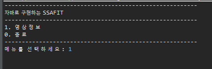
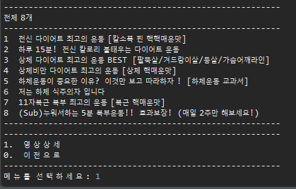
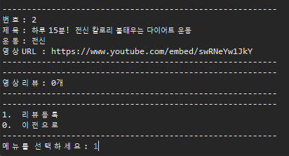
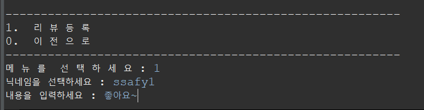
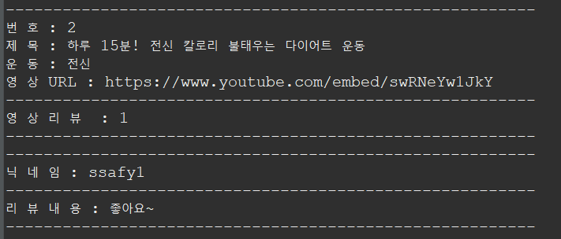

프로젝트 소개

SSAFY 9기 JAVA 관통 프로젝트

제공되는 영상정보 데이터 파일을 기반으로 필요한 정보를 파싱 처리한 후 
영상정보를 제공하는 목록 화면과 영상에 대한 리뷰를 관리하는 프로그램을 구현한다.

역할

정의석-프로젝트 설계, UI 및  전체 로직 구현

박대균-세부 메소드 및 클래스 설계, 파일 입출력 

동작설명
- 초기화면
1을 입력하면 다음 페이지로 이동하고, 0을 입력 하면 종료
그 외의 값을 입력하면 초기화면이 다시 실행

- 비디오 리스트 페이지
1을 입력하면 상세 비디오 정보 페이지로 이동, 
1을 입력하면 초기화면으로 이동, 
그 외의 값을 입력하면 비디오 리스트 페이지가 다시 실행

- 상세 영화 페이지
1을 입력하면 비디오 리뷰 등록 페이지로 이동, 
0을 입력하면 비디오 리스트 페이지로 이동, 
그 외의 값을 입력해도 비디오 리스트 페이지로 이동

- 비디오 리뷰 작성 페이지
1을 입력하여 리뷰 등록, 
0을 입력하면 비디오 리스트 페이지로 이동 
(그 외의 값에 대한 예외 처리는 구현 실패)

- 리뷰 등록 완료

